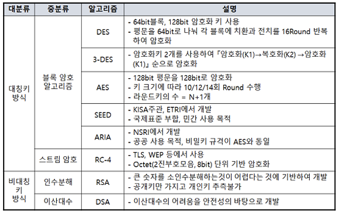
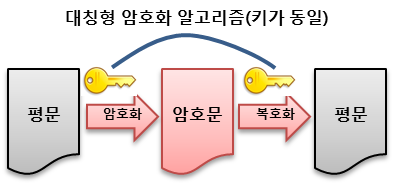
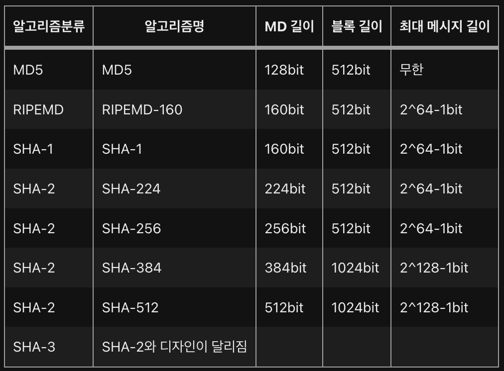

# KieaSecModule
Kiea Security Test Module about AES256(?), HMAC...

---
[KISA](https://seed.kisa.or.kr/kisa/index.do)

[README_01.md](./README_01.md)

---
# 정의

- 평문(Plaintext) : 해독 가능한 형태의 메시지(암호화전 메시지)
- 암호문(Cipertext) : 해독 불가능한 형태의 메시지(암호화된 메시지
- 암호화(Encryption) : 평문을 암호문으로 변환하는 과정
- 복호화(Decryption) : 암호문을 평문으로 변환하는 과정
- 전자서명
  - 송신자의 Private Key로 메시지를 서명하여 전달
  - 수신자측에서는 송신자의 Public Key를 이용하여 서명값을 검증
- 양방향암호화 : 암호화와 복호화과정을 통해 송.수신간 주고받는 메시지를 안전하게 암.복호화하는 과정
- 단방향암호화 : 해싱(Hashing)을 이용한 암호화 방식으로 양방향과는 다른 개념으로, 평문을 암호문으로 암호화는 가능하지만 암호문을 평문으로 복호화 하는 것은 불가능.

---
# 양방향 암호화(대칭/비대칭 키)

- 대칭키 : 같은 키를 이용하여 메시지를 암.복호화 하는 것
- 비대칭키 : 메시지를 암호화 하는 키와 복호화 하는 키가 다름
  - 암호화 알고리즘에 따라 사용방식이 다를수도 있다
  - 전자서명을 위한 알고리즘에서는 Private Key로 메시지를 서명하고, Public Key로 검증
  - 메시지 교환에서는 Public Key로 메시지를 암호화하고 Private Key로 복호화한다.

## 대칭키 암호화

- 종류 : AES128, AES256, SEED(국내표준)
- 암.복호화 키가 같음
- 문제점은 수신측에 키를 전달하는 과정에서 유출될 우려가 있음
- 스트림기반, 블록기반의 암호화로 나눌수 있음

### 스트림기반 암호화

- 비트단위로 암호화하는 방식.
- LFFSR, MUX generator 등의 스트림기반 암호화 알고리즘
- 속도가 빠르고 오류 전파 현상이 없다는 장점
- 주로 오디오/비디오 스트리밍 시 사용

### 블록기반 암호화

- 블록 단위로 암호화를 수행하는 방식
- 문자열 단어 하나하나를 블록으로 나누어 암호화하는 과정
- DES, AES, IDEA, SEED 등의 블록기반 암호화 알고리즘

## 비대칭키 암호화
- 종류 : DSA(전자서명), RSA(메시지 암.복호화)
- 대칭키에 비해서는 느리다는 단점이 있음
- 키생성시 Private Key와 Public Key 2개의 키가 도출되며, Public Key는 공개해도 문제가 되지 않는다.
- 인수분해, 이산대수, 타원곡선 암호화로 나뉨

### ECC(Elliptic Curve Cryptography)

- 타원곡선 암호화로써 RSA에 비해 짧은 길이의 키를 사용하면서도 비슷한 수준의 안정성을 제공
- 비트코인 및 이더리움에서 ECC알고리즘을 이용

### ECC 기반의 암호화

- ECDSA(Elliptic Curve Digital Signature Algorithm)
  : 전자서명(ECC 암호화 알고리즘을 전자서명에 사용한 것)
- ECDH(Elliptic Curve Diff-Hellman)
  : 키교환 알고리즘(자신의 Private Key와 상대방의 Public Key를 사용하여 공통된 Secret 키를 도출)
- ECIES(Elliptic Curve Integreated Encryption Scheme)
  : 통합 암호화 방식(Public Key로 암호화하고 Private Key로 복호화)

---
# 단방향 암호화
- Hash를 이용하여 암호화하는 과정
- 평문을 암호화할순 있지만, 복호화는 불가능하다
- 데이터의 진위여부는 확인하고 싶으나, 본 데이터의 Privacy를 지키고 싶은 경우 사용
- ex) Bcrypt-JWT (참고:인증(Authentication) & 인가(Authorization))
- hash할 때, hash 값은 크기와 알고리즘에 따라 암호문의 결과가 완전 상이함

## 단방향 Hash 알고리즘

---
# Reference

- (https://www.kisa.or.kr/jsp/common/downloadAction.jsp?bno=259&dno=82&fseq=1)
- (https://alexonepath.github.io/category/etc/etc-crypto.html#)
- (https://jusungpark.tistory.com/34)
- (https://javaplant.tistory.com/26)
- (https://www.twilio.com/blog/what-is-public-key-cryptography)
- (https://m.blog.naver.com/PostView.nhn?blogId=jvioonpe&logNo=220703730770&proxyReferer=https:%2F%2Fwww.google.com%2F)

